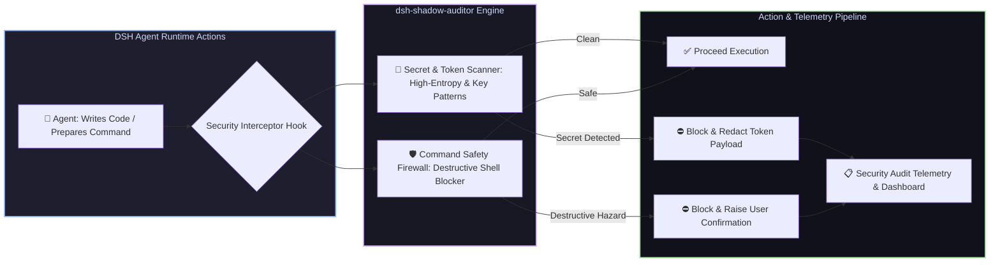

# 📦 @goodandready/dsh-shadow-auditor

<div align="center">

<h3>Background Security Guard, Secret Leakage Scanner & Destructive Command Firewall for DeepSeek Harness</h3>

<p align="center">
  <a href="https://www.npmjs.com/package/@goodandready/dsh-shadow-auditor"></a>
  <a href="LICENSE"></a>
  <a href="https://github.com/topics/dsh-plugin"></a>
  <a href="https://nodejs.org"></a>
</p>

<!-- Showcase Catalog Button -->
<p align="center">
  <a href="https://goodandready.app/"></a>
</p>

<p align="center">
  <a href="README.md"><b>🇬🇧 English</b></a> •
  <a href="README.ru.md"><b>🇷🇺 Русский</b></a> •
  <a href="README.zh.md"><b>🇨🇳 中文说明</b></a>
</p>

<table align="center">
  <tr>
    <td align="center">
      ⭐ <strong>If you like this plugin, please star it on GitHub</strong> — it shows me that the plugin is useful to you and motivates me to keep developing it.
      <br><br>
      🐛 <strong>If you find a bug or would like to request a feature</strong>, open a GitHub issue in any language — I will review your proposal and implement useful suggestions in a future plugin version.
    </td>
  </tr>
</table>

</div>

---

## ⚡ Overview

**`dsh-shadow-auditor`** provides real-time, non-intrusive background security auditing and command safety protection for **DeepSeek Harness** agents.

When autonomous agents write code, stage files, or run shell scripts, there is a constant risk of accidental API key/secret leakage into git diffs or unintentional execution of destructive terminal commands (`rm -rf /`, dangerous database wipes, credential exports).

`dsh-shadow-auditor` operates as an in-process security firewall, scanning code diffs for private tokens and verifying terminal commands before execution.



---

## ✨ Key Capabilities & Modules

### 1. 🔑 Pre-Flight Secret & Credential Scanning (`lib/guards/secrets.js`)
* Real-time regex and entropy scanning for API keys, private tokens, RSA/SSH keys, OAuth bearer secrets, and database credentials;
* Intercepts code before transmission to LLMs or storage in version control;
* Automatic token redaction and masking in logs.

### 2. 🛡️ Destructive Command Firewall (`lib/guards/command.js`)
* Analyzes shell command AST and argument tokens before terminal execution;
* Flags and blocks dangerous operations (unbounded `rm -rf`, disk wipes, fork bombs, destructive `dd`, accidental recursive permission overwrites);
* Requires explicit user override for hazardous scripts.

### 3. 📋 Security Rules Engine & Live Dashboard (`lib/client.js`)
* In-memory configurable rule matrix with toggleable strictness;
* Security audit badge and incident log viewer in the DSH Web UI.

---

## 🛠️ Agent Tools Reference (3 Tools)

| Tool Name | Parameters | Description |
|---|---|---|
| `shadow_auditor_scan_diff` | `diff: string` | Scans a unified diff or code chunk for exposed API keys, credentials, and private tokens |
| `shadow_auditor_check_command` | `command: string` | Evaluates shell commands against destructive execution patterns and safety policies |
| `shadow_auditor_rules_list` | *(none)* | Returns currently active security rules, patterns, and enforcement modes |

---

## 📦 Quick Installation

```bash
dsh plugin --profile web add @goodandready/dsh-shadow-auditor
```

---

## ⚙️ Configuration Reference (`settings.yaml`)

```yaml
dsh-shadow-auditor:
  strictSecretScanning: true    # Block execution if API keys or tokens are detected in diffs
  blockDangerousCommands: true  # Block destructive shell commands automatically
  enableAuditBadge: true        # Display security shield badge in UI and approval dialogs
```

---

---

## 🔄 Version History

### v0.2.9 (Security Evolution & Canonical Localization)
- **Canonical Language Standard**: Complete runtime and client localization in English (`en`) and Chinese (`zh`); Russian localization managed via `goodandready/dsh-russian-lang`.
- **Packaging Hygiene**: Clean distribution package with non-product files (`AGENTS.md`, `index.md`) purged; strict $\le 256$ KiB file limit.
- **Real-Time Interception Feed**: Live telemetry event viewer with filtering by All, Shell Guard, Diff Gate, and High Risk.
- **Configurable Security Policies**: Custom regex blocklists for shell commands and sensitive paths, with Enforce vs Audit-only modes.
- **Diff Gate Visual Inspector & Remediation**: Inline inspector showing offending code snippets and actionable safe remediation hints.
- **File Integrity & Secret Anchor Monitor**: Proactive interception of file tools touching `.env`, `settings.yaml`, and credential anchors.
- **Compliance Export**: One-click export of audit logs to JSON or Markdown Operation Bills from UI or HTTP endpoints.

### v0.2.8 (UI Unification & Settings Sync)
* **Unified UI Style (Aligned with `dsh-clinebot`)**: Redesigned client settings card into four structured section cards using native DSH design tokens (`--dsw-alias-*`), clean responsive grids, status badges, and styled form controls.
* **Complete Settings Synchronization**: Added full reactive tracking and draft persistence for `diffGateMode`, `enableSastScan`, and `enablePromptInjectionScan`.
* **Hardened Error Handling**: Replaced silent catch blocks with logger diagnostics.
* **Expanded Test Coverage**: Added dedicated unit test suite `test/ui-and-stability-028.test.mjs` (26 test suites passing).

### v0.2.7 (Stability Refinements & False-Positive Elimination)
* **Secret-Write False-Positive Fix**: `secret-write` guard strictly targets actual secret and credential stores (`.env`, `.credentials`, SSH keys) without falsely matching developer scripts such as `check_token.js` or test suites `test_secret.py`.
* **Smart SAST Comment Filtering**: Comments containing SQL keywords or `eval` examples no longer trigger code security alerts. Safe relative path traversal via `import.meta.url` and `__dirname` is permitted.
* **Diff Gate Resource Limits**: Line scanning truncates beyond 2048 characters to protect against minified bundle stalls, and test files bypass prompt injection heuristics.
* **Bounded Chat /audit**: Chat slash command reads recent 50 entries by default to prevent OOM on large logs (override with `--all`).
* **Tab Visibility Polling**: Background tab polling in `AuditShieldChip` is paused when document is hidden.

### v0.2.4 (DSH Authoring Standards & Settings UI Card Enhancements)
* **Comprehensive Settings Card Controls**: exposed audit log controls in the Web UI card (`enableAuditLog`, `maxFileSizeMb`, `retentionDays`) with English and Russian localization (#34).
* **Elimination of Dual Registration**: removed `setTimeout` delayed fallback to `settings.section`; settings card registers cleanly and atomically into `settings.plugin.item` (#35).
* **Disabled Form on Unavailable Snapshot**: when settings snapshot is `unavailable`, form inputs and the save button are disabled (`disabled: true`) and a warning notice is displayed (#32).
* **Peer Dependencies Cleanup**: removed unused `@deepseek-ai/dsh-credentials` from `peerDependencies` in `package.json` (#33).
* **Style Isolation**: added `data-dsh-plugin="dsh-shadow-auditor"` to `<style>` tag to prevent style purging by adjacent plugins.
* **Design Contract**: added `docs/design/DESIGN.md` establishing the design specifications for all plugin surfaces.

### v0.2.3 (Exfiltration False-Positive Hotfix)
* **Resolved false-positive on legitimate API authorization**: allows agents to read and pass API keys in headers (e.g. `K=$(grep KEY ~/.dsh/.credentials.yaml) && curl ... -H "Authorization: Bearer $K"`).
* **Precise Exfiltration Payload Detection**: network exfiltration guard now strictly targets actual credential file payload attachments (`-d @.env`, `-F file=@...`, `--post-file=...`), direct file piping (`cat .env | curl/nc`), input redirection (`< .env`), and remote file copies (`scp/rsync`).

### v0.2.0 (Audit Suite, Risk Scoring & Exfiltration Protection)
* **Chat Slash Command `/audit`**: Generates a detailed Operation Bill directly in the DSH chat with tool call counts, risk scoring (0–100), suspicious activity tables, and intercepted commands. Flags: `--turn` (last turn only), `--all` (all sessions), `--json`, `--since=YYYY-MM-DD`, `--limit=N` (defaults to 50).
* **Persistent Audit Log (`AuditRecorder`)**: Records audit events to `<DSH_HOME>/shadow-auditor/<yyyy-mm>.jsonl` with serialized Promise write queue (no concurrency interleaving), automatic `.gz` compression above 50 MB, and 30-day retention pruning.
* **Deep Core Telemetry Hooks**: Global interception via `tools/result` to capture actual execution outcomes (`result.isError`), sanitized error messages, and turn boundaries via `session/event` (`turn/end`).
* **Network Exfiltration Guard**: Intercepts and blocks network utilities (`curl`, `wget`, `scp`, `ssh`, `nc`, `socat`) attempting to transmit credential files (`.env`, `id_rsa`, `.git-credentials`, etc.).
* **Workspace Escape Redirect Guard**: Blocks shell redirects `>` and `>>` pointing outside the workspace (e.g. `/etc/`, `~/.bashrc`, `%USERPROFILE%`, cron).
* **Smart `git push --force`**: Blocks `--force` targeting protected branches (`main`, `master`, `prod`) and protected remotes while preserving full rebasing freedom for local feature branches.
* **Deterministic Risk Scoring (0–100)**: Objective scoring without LLM overhead, featuring a 10-minute rolling window for cumulative repeat-tag and consecutive high-risk penalties.
* **Recursive Fixed-Point Redaction**: The `redactText` / `redactValue` module iteratively sanitizes deeply nested structures from tokens, passwords, and `.env` assignments until stable.

### v0.2.6 (Code-Security Diff Gate & SAST Engine)
* **Code-Security Diff Gate (`lib/diff-gate/`)**: Multi-category scanner analyzing file diffs and modifications on approval boundaries.
* **Normalized Finding Schema**: Structured findings with stable identifiers (`SEC-*`, `SAST-*`, `PI-*`), severity, category, evidence range, explanation, and suggestion-only remediations.
* **Enhanced Secret Scanner**: Added Shannon entropy scoring for high-entropy tokens and expanded API key detection.
* **Lightweight SAST Engine**: Detects SQL injection, command injection in shell execution, path traversal, hardcoded passwords, and arbitrary code evaluation.
* **Prompt-Injection Heuristic Scanner**: Detects instruction overrides, jailbreak markers, and confidential context exfiltration within modified files.
* **Gate Policy (`disabled`, `warning`, `block`)**: Configurable via Web UI settings card; block mode stops critical/high vulnerabilities from executing.
* **Auditable Inline Suppression**: Support for `// shadow-audit-ignore: <ruleId>` comments to bypass false positives without disabling global rules.

### v0.2.5 (Stability, Memory & UI Security Shield Overhaul)
* **Header Security Shield Slot (`conversation.session.header.utilities`)**: Injected real-time `AuditShieldChip` showing session security status and quick audit popup.
* **OOM Prevention in Audit Recorder**: Added `readRecent(limit)` to stream and cap reading of recent records without unpacking historical compressed `.gz` archives.
* **Slash Command `--limit=N`**: `/audit` defaults to the last 50 records tail with configurable `--limit=N`.
* **Lifecycle & Memory Leak Cleanup**: Session turn and event caches are properly pruned on `session/destroy` and capped with LRU eviction.
* **Command Guard False-Positive Fixes**: Refined regexes to safely allow harmless commands such as `grep -i kill` and `systemctl status` while strictly blocking destructive operations.
* **Reduced LLM Cognitive Overhead**: Removed redundant `shadow_auditor_rules_list` tool to minimize model prompt pollution.

### v0.1.4 (Settings Slot Registration Hotfix)
* **Declaration-Aware Slot Injection (`settings.plugin.item`)**: Plugin card registration now uses `ctx.slots.inject`, eliminating loader crashes caused by registering before the host entry declares the slot (`slot is not declared`).
* **Fallback Settings Section (`settings.section`)**: Added automatic fallback to a standalone settings section managed with a timer and disposed via `ctx.effect` if `settings.plugin.item` is unavailable.

### v0.1.3 (Security Hardening & Stability Hotfix)
* **Compound Command Analysis (`findDangerous`)**: Chained command expressions (`&&`, `||`, `;`, newline continuations) are segmented and verified, preventing firewall bypasses via allowlisted prefixes (`systemctl status && rm -rf /`).
* **Strict Key Allowlisting (`scanSecrets`)**: Eliminated false-positive allowlisting of real API tokens that happen to contain the word "example".
* **Automatic Secret Masking (`maskSecret`)**: Intercepted credentials and tokens are redacted (`sk-pr...****...1234`) before being sent via HTTP API or rendered in Web UI.
* **Full-Length File Scanning**: Removed arbitrary 8 KB cutoff when scanning file edits/writes; all files of any size are thoroughly inspected.
* **Cordis Lifecycle & Event Context**: Tool registrations are encapsulated in `ctx.effect` for clean hot-reload teardown; fixed context scoping for `approval/asked` listener.
* **Web UI Performance & Stability**: Eliminated disruptive timer-based form draft resets, scoped `/audit` polling to expanded state, and added unmount guards.
* **HTTP No-Store**: Added `Cache-Control: no-store` header to the `/dsh-shadow-auditor/audit` endpoint.

---

## 📄 License

MIT © [GooDAnDReaDY](https://github.com/GooDAnDReaDY)
