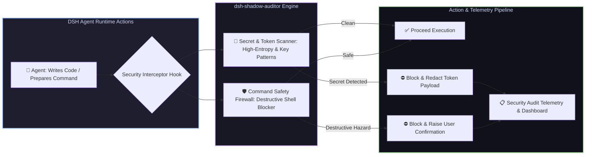

# 📦 @goodandready/dsh-shadow-auditor

<div align="center">

<h3>Background Security Guard, Secret Leakage Scanner & Destructive Command Firewall for DeepSeek Harness</h3>

<p align="center">
  <a href="https://www.npmjs.com/package/@goodandready/dsh-shadow-auditor"></a>
  <a href="LICENSE"></a>
  <a href="https://github.com/topics/dsh-plugin"></a>
  <a href="https://nodejs.org"></a>
</p>

<!-- Showcase Catalog Button -->
<p align="center">
  <a href="https://goodandready.app/"></a>
</p>

<p align="center">
  <a href="README.md"><b>🇬🇧 English</b></a> •
  <a href="README.ru.md"><b>🇷🇺 Русский</b></a> •
  <a href="README.zh.md"><b>🇨🇳 中文说明</b></a>
</p>

</div>

---

## ⚡ Overview

**`dsh-shadow-auditor`** provides real-time, non-intrusive background security auditing and command safety protection for **DeepSeek Harness** agents.

When autonomous agents write code, stage files, or run shell scripts, there is a constant risk of accidental API key/secret leakage into git diffs or unintentional execution of destructive terminal commands (`rm -rf /`, dangerous database wipes, credential exports).

`dsh-shadow-auditor` operates as an in-process security firewall, scanning code diffs for private tokens and verifying terminal commands before execution.



---

## ✨ Key Capabilities & Modules

### 1. 🔑 Pre-Flight Secret & Credential Scanning (`lib/guards/secrets.js`)
* Real-time regex and entropy scanning for API keys, private tokens, RSA/SSH keys, OAuth bearer secrets, and database credentials;
* Intercepts code before transmission to LLMs or storage in version control;
* Automatic token redaction and masking in logs.

### 2. 🛡️ Destructive Command Firewall (`lib/guards/command.js`)
* Analyzes shell command AST and argument tokens before terminal execution;
* Flags and blocks dangerous operations (unbounded `rm -rf`, disk wipes, fork bombs, destructive `dd`, accidental recursive permission overwrites);
* Requires explicit user override for hazardous scripts.

### 3. 📋 Security Rules Engine & Live Dashboard (`lib/client.js`)
* In-memory configurable rule matrix with toggleable strictness;
* Security audit badge and incident log viewer in the DSH Web UI.

---

## 🛠️ Agent Tools Reference (3 Tools)

| Tool Name | Parameters | Description |
|---|---|---|
| `shadow_auditor_scan_diff` | `diff: string` | Scans a unified diff or code chunk for exposed API keys, credentials, and private tokens |
| `shadow_auditor_check_command` | `command: string` | Evaluates shell commands against destructive execution patterns and safety policies |
| `shadow_auditor_rules_list` | *(none)* | Returns currently active security rules, patterns, and enforcement modes |

---

## 📦 Quick Installation

```bash
dsh plugin --profile web add @goodandready/dsh-shadow-auditor
```

---

## ⚙️ Configuration Reference (`settings.yaml`)

```yaml
dsh-shadow-auditor:
  strictSecretScanning: true    # Block execution if API keys or tokens are detected in diffs
  blockDangerousCommands: true  # Block destructive shell commands automatically
  redactSecretsInLogs: true     # Replace detected secrets with [REDACTED] in audit logs
```

---

## 📄 License

MIT © [GooDAnDReaDY](https://github.com/GooDAnDReaDY)
