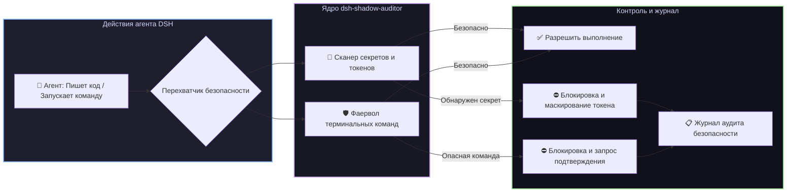

# 📦 @goodandready/dsh-shadow-auditor

<div align="center">

<h3>Фоновый аудитор безопасности, сканер утечек ключей и защита от деструктивных команд для DeepSeek Harness</h3>

<p align="center">
  <a href="https://www.npmjs.com/package/@goodandready/dsh-shadow-auditor"></a>
  <a href="LICENSE"></a>
  <a href="https://github.com/topics/dsh-plugin"></a>
  <a href="https://nodejs.org"></a>
</p>

<!-- Обязательная кнопка перехода на витрину всех проектов -->
<p align="center">
  <a href="https://goodandready.app/"></a>
</p>

<p align="center">
  <a href="README.md"><b>🇬🇧 English</b></a> •
  <a href="README.ru.md"><b>🇷🇺 Русский</b></a> •
  <a href="README.zh.md"><b>🇨🇳 中文说明</b></a>
</p>

</div>

---

## ⚡ Обзор

**`dsh-shadow-auditor`** обеспечивает непрерывный фоновый аудит безопасности и защиту от выполнения опасных команд для агентов **DeepSeek Harness**.

При написании кода, редактировании файлов или запуске терминальных команд автономными агентами существует риск случайной утечки API-ключей, токенов доступа или выполнения разрушительных скриптов (`rm -rf /`, форк-бомб, случайной перезаписи системных файлов).

Плагин действует как внутрипроцессный фаервол безопасности, проверяя дифы кода на наличие секретов и блокируя деструктивные операции в терминале.



---

## ✨ Ключевые возможности

### 1. 🔑 Сканирование утечек ключей и паролей (`lib/guards/secrets.js`)
* Сканирование дифов на API-ключи, приватные сертификаты, RSA/SSH ключи и токены баз данных;
* Блокировка отправки конфиденциальных данных до фиксации в коммитах или передачи наружу;
* Автоматическая замена секретов на `[REDACTED]` в журналах.

### 2. 🛡️ Защита от опасных команд (`lib/guards/command.js`)
* Синтаксический анализ терминальных команд перед выполнением;
* Перехват опасных паттернов (`rm -rf /`, деструктивный `dd`, сброс баз данных, снос прав доступа);
* Требование явного подтверждения пользователя для рискованных сценариев.

### 3. 📋 Настраиваемые правила и панель Web UI (`lib/client.js`)
* Гибкое управление правилами безопасности;
* Индикатор статуса и журнал инцидентов безопасности в интерфейсе DSH.

---

## 🛠️ Инструменты агента (3 инструмента)

| Имя инструмента | Параметры | Описание |
|---|---|---|
| `shadow_auditor_scan_diff` | `diff: string` | Проверяет диф кода на наличие приватных ключей и токенов |
| `shadow_auditor_check_command` | `command: string` | Оценивает терминальную команду на безопасность перед запуском |
| `shadow_auditor_rules_list` | *(нет)* | Возвращает список активных правил безопасности и режимов |

---

## 📦 Быстрая установка

```bash
dsh plugin --profile web add @goodandready/dsh-shadow-auditor
```

---

## ⚙️ Пример конфигурации (`settings.yaml`)

```yaml
dsh-shadow-auditor:
  strictSecretScanning: true    # Блокировать выполнение при обнаружении ключей в коде
  blockDangerousCommands: true  # Блокировать разрушительные команды в терминале
  redactSecretsInLogs: true     # Маскировать секреты в логах на [REDACTED]
```

---

## 📄 Лицензия

MIT © [GooDAnDReaDY](https://github.com/GooDAnDReaDY)
