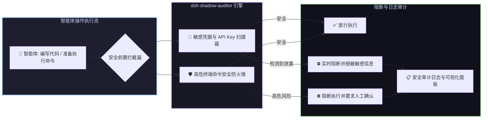

# 📦 @goodandready/dsh-shadow-auditor

<div align="center">

<h3>DeepSeek Harness 后台安全审计卫士、敏感凭据泄漏扫描与高危指令防火墙插件</h3>

<p align="center">
  <a href="https://www.npmjs.com/package/@goodandready/dsh-shadow-auditor"></a>
  <a href="LICENSE"></a>
  <a href="https://github.com/topics/dsh-plugin"></a>
  <a href="https://nodejs.org"></a>
</p>

<!-- 官方展示中心跳转按钮 -->
<p align="center">
  <a href="https://goodandready.app/"></a>
</p>

<p align="center">
  <a href="README.md"><b>🇬🇧 English</b></a> •
  <a href="README.ru.md"><b>🇷🇺 Русский</b></a> •
  <a href="README.zh.md"><b>🇨🇳 中文说明</b></a>
</p>

</div>

---

## ⚡ 插件概览

**`dsh-shadow-auditor`** 为 **DeepSeek Harness** 智能体提供全时段后台安全审计与高危命令拦截防护。

智能体在编写代码、处理配置或执行 Shell 脚本时，存在误将 API 密钥、私钥凭据提交至代码库或执行破坏性终端命令（如无边界 `rm -rf /`、数据库删库、敏感权限覆写）的风险。

本插件作为进程级安全防火墙，实时扫描代码 Diff 中的敏感信息，并在终端命令执行前执行语法级安全拦截。



---

## 📦 安装指南

```bash
dsh plugin --profile web add @goodandready/dsh-shadow-auditor
```

---

---

## 🔄 版本记录

### v0.2.3 (网络外发误报热修复)
* **消除合法 API 调用的误报**: 允许通过 shell 从本地凭据配置读取密钥并作为请求头传入 (如 `K=$(grep KEY ~/.dsh/.credentials.yaml) && curl ... -H "Authorization: Bearer $K"`).
* **精确网络外发攻击分析**: 仅针对将凭据文件本身作为负载传输 (`-d @.env`, `-F file=@...`, `--post-file=...`)、直接管道传输 (`cat .env | curl/nc`)、输入重定向 (`< .env`) 以及远程文件拷贝 (`scp/rsync`) 进行阻断。

### v0.2.0 (全功能审计套件、风险评分与外发防护)
* **DSH 聊天斜杠命令 `/audit`**: 在对话中直接生成详尽的运维风险账单 (Operation Bill)——汇总工具调用次数、风险评分 (0–100)、可疑调用明细表以及被拦截的危险指令。支持参数：`--turn` (仅限当轮)、`--all` (全量历史)、`--json`、`--since=YYYY-MM-DD`。
* **持久化审计归档 `AuditRecorder`**: 将调用事件以 JSONL 格式保存在 `<DSH_HOME>/shadow-auditor/<yyyy-mm>.jsonl` 中，依托 Promise 写入队列消除并发竞争，单文件超过 50 MB 自动 `.gz` 压缩并保留 30 天。
* **深层内核遥测钩子**: 全局监听 `tools/result` 获取工具真实执行结果 (`result.isError`) 与脱敏报错信息，并通过 `session/event` (`turn/end`) 精确切分交互轮次。
* **凭据网络外发防御**: 拦截携带敏感凭据文件 (`.env`, `id_rsa`, `.git-credentials` 等) 的网络工具调用 (`curl`, `wget`, `scp`, `ssh`, `nc`, `socat`)。
* **越界重定向防御**: 拦截指向工作区外部（如 `/etc/`, `~/.bashrc`, `%USERPROFILE%`, cron）的 shell 输出重定向 (`>` 与 `>>`)。
* **智能 `git push --force`**: 严格锁定受保护分支 (`main`, `master`, `prod`) 及受控远端的强制推送，同时保留开发者本地特性分支的自由 rebase 能力。
* **确定性风险评分 (0–100)**: 无需消耗大模型 token 的快速风险定级引擎，配备 10 分钟滑动窗口识别高频同类操作与连续高危行为。
* **不动点递归脱敏**: `redactText` / `redactValue` 模块递归清理深层嵌套结构中的 token、密码及 `.env` 敏感赋值，直至数据完全收敛。

### v0.1.4 (设置插槽注册热修复)
* **声明感知的插槽注入 (`settings.plugin.item`)**: 设置卡片注册全面迁移至 `ctx.slots.inject`，彻底解决在父级插槽尚未声明时直接注册导致的加载器崩溃 (`slot is not declared`)。
* **后备设置项 (`settings.section`)**: 在当前 DSH 构建缺少插件卡片插槽时，自动降级至独立设置分区，并通过 `ctx.effect` 安全管理生命周期。

### v0.1.3 (安全加固与稳定性修复)
* **复合命令链式分析 (`findDangerous`)**: 解析 `&&`、`||`、`;` 和换行续行命令，杜绝利用白名单安全命令掩盖高危操作 (`systemctl status && rm -rf /`) 的绕过漏洞。
* **精准密钥过滤 (`scanSecrets`)**: 修复包含 "example" 子串的真实有效密钥被误放行的问题。
* **敏感凭据脱敏保护 (`maskSecret`)**: 拦截到的密钥在存入审计日志、HTTP API 返回及 Web UI 渲染前均执行脱敏 (`sk-pr...****...1234`)。
* **文件全量扫描**: 移除文件写入/编辑时 8 KB 的扫描上限截断，完整检测任意体积的文件。
* **Cordis 生命周期与上下文完善**: 工具注册统一交由 `ctx.effect` 管理，支持热重载注销；修复 `approval/asked` 事件上下文。
* **Web UI 体验与内存泄漏优化**: 移除导致表单编辑冲突的定时重置逻辑，仅在面板展开时轮询审计接口，防止组件卸载时发生内存泄漏。
* **API 缓存控制**: 为 `/dsh-shadow-auditor/audit` 路由显式增加 `Cache-Control: no-store` 标头。

---

## 📄 开源协议

MIT © [GooDAnDReaDY](https://github.com/GooDAnDReaDY)
